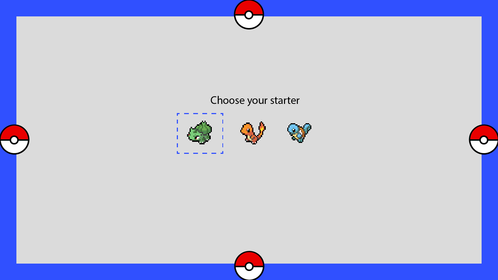
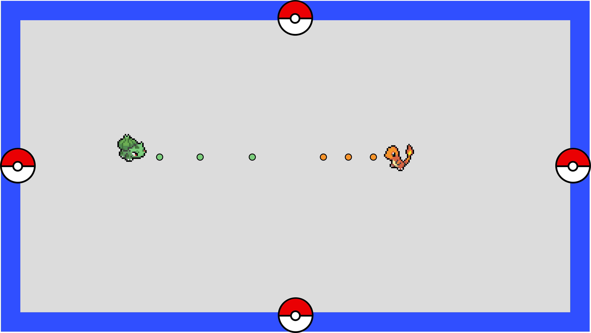

# Pokémon Free 4 All
This web application is a real time multiplayer game. The user can choose between 3 pokémon sprites, fetched by the [Poké API](https://pokeapi.co/). The goal of the game is to defeat the oppnonents by shooting them down (based on the mini game Tanks).

---
## Concept
Choose a starter pokemon as your character to find your opponents.



When a pokemon is chosen, you'll enter a random available room to find opponents in. A maximum of 4 players can join the same room.



---
## Data Model


---
## MoSCoW
#### Must haves
- [x] Connection to API
- [x] Real Time connection
- [x] Character movement
- [ ] Shooting with cursor
- [ ] Physics (borders, collision etc.)
#### Should haves
- [ ] Use sprites as character
- [ ] Asign players to rooms
#### Could haves
- [ ] Maximum of 4 players per room
- [ ] Let players create own room
- [ ] Turning sprites based on cursor position
- [ ] Database & authorization
#### Would haves
- [ ] Choose character sprite out full database
- [ ] Chat funcionallity
- [ ] Leaderboard and scores

---
## Dependencies
| Dependencies                                            | Dev Dependencies                                  |
| ------------------------------------------------------- | ------------------------------------------------- |
| [Node JS](https://nodejs.org/en/)                       | [Nodemon](https://www.npmjs.com/package/nodemon)  |
| [Express](https://www.npmjs.com/package/express)        |
| [Socket.io](https://www.npmjs.com/package/socket.io)    |
| [Node-fetch](https://www.npmjs.com/package/node-fetch)  |

---
### Guide
1. Download the zip-file or clone the repo
2. Run `npm i` inside the terminal to install dependency packages
3. Run the application in local mode:
    ```terminal
    npm run start
    ```
    or development mode:
    
    ```terminal
    npm run dev
    ```