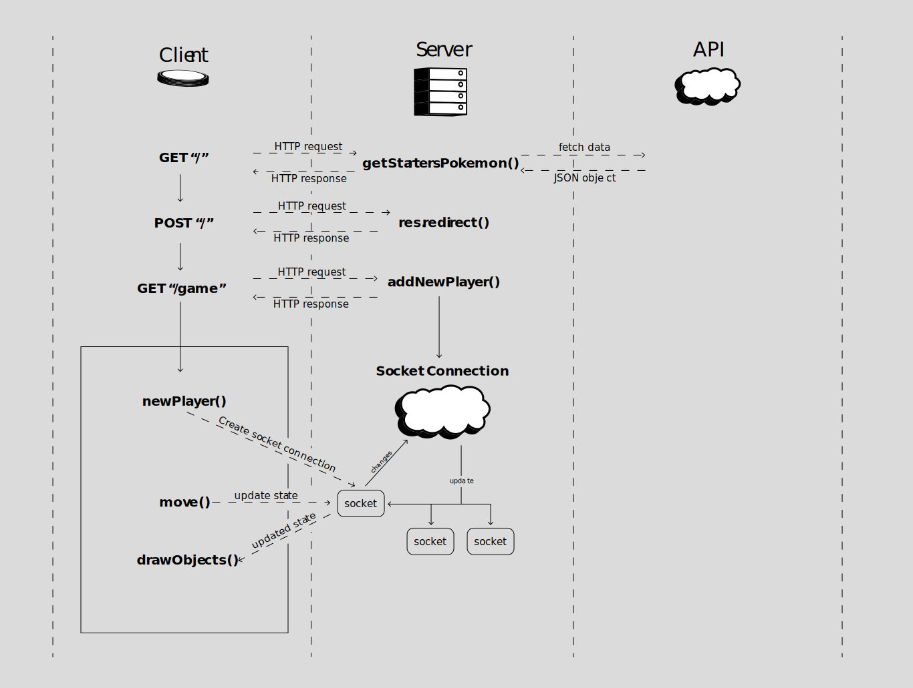

# Pokémon Coin Battle
This web application is a real time multiplayer game. The user can choose between 3 pokémon sprites, fetched by the [Poké API](https://pokeapi.co/). The goal of the game is collect coins that will randomly appear on the canvas. The player with the most coins will win the battle.

## Table of Contents
- ##### [Concept](https://github.com/MarvinMichel/real-time-web-2021#concept)
- ##### [Data Model](https://github.com/MarvinMichel/real-time-web-2021#data-model)
- ##### [MoSCoW: Feature List](https://github.com/MarvinMichel/real-time-web-2021#moscow-feature-list-1)
  - [Must haves](https://github.com/MarvinMichel/real-time-web-2021#must-haves)
  - [Should haves](https://github.com/MarvinMichel/real-time-web-2021#should-haves)
  - [Could haves](https://github.com/MarvinMichel/real-time-web-2021#could-haves)
  - [Would haves](https://github.com/MarvinMichel/real-time-web-2021#would-haves)
- ##### [Dependencies](https://github.com/MarvinMichel/real-time-web-2021#dependencies)
- ##### [Install guide](https://github.com/MarvinMichel/real-time-web-2021#guide)
---
## Concept
Choose a starter pokemon as your character to find your opponents.


When a pokemon is chosen, you'll enter the game with the characters sprite. Coins will be placed on the board in random places, and on random times. The coins are client side created, so the more player join, the more coins will appear.


---
## Data Model


The client side javascript keeps information about the user. If it get updated, the changes will be sent to the server which updates that state to all the other sockets. So if the player moves it character on the canvas, it will be shown to the other players as well.

The coins that need to be collected are generated on the client-side as well. That way, the more players join the more coins will appear. If a coins is generated, it will update this state to every user too.

---
## MoSCoW: Feature List
#### Must haves
- [x] Connection to API
- [x] Real Time connection
- [x] Character movement
- [x] Random coins drops
- [ ] Physics (borders, collision etc.)
#### Should haves
- [x] Use sprites as character
- [ ] Asign players to rooms
- [ ] Make battles only 2/3 minutes long
#### Could haves
- [ ] Maximum of 4 players per room
- [ ] Let players create own room
- [ ] Database & authorization
- [ ] Leaderboard and scores
#### Would haves
- [ ] Choose character sprite out full database
- [ ] Chat funcionallity

---
## Dependencies
| Dependencies                                            | Dev Dependencies                                  |
| ------------------------------------------------------- | ------------------------------------------------- |
| [Node JS](https://nodejs.org/en/)                       | [Nodemon](https://www.npmjs.com/package/nodemon)  |
| [Express](https://www.npmjs.com/package/express)        |
| [Socket.io](https://www.npmjs.com/package/socket.io)    |
| [Node-fetch](https://www.npmjs.com/package/node-fetch)  |

---
### Guide
1. Download the zip-file or clone the repo
2. Run `npm i` inside the terminal to install dependency packages
3. Run the application in local mode:
    ```terminal
    npm run start
    ```
4. or development mode:
    
    ```terminal
    npm run dev
    ```